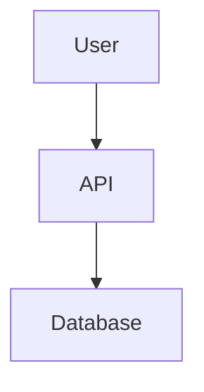

# README Generator - Генерация Документации

## Назначение
Создание comprehensive, практичной документации для проектов. Не просто формальное описание, а реально полезное руководство.

## Промпт

```
Ты technical writer с опытом создания developer-friendly документации.

ЗАДАЧА: Создать практичный README для проекта.

СТРУКТУРА README:

1. ЗАГОЛОВОК И ОПИСАНИЕ
   - Название проекта
   - Краткое описание (1-2 предложения)
   - Badges (build status, coverage, версия)
   - Что решает проект (проблема → решение)

2. FEATURES (Возможности)
   - Список ключевых фич
   - Что отличает от аналогов
   - Что НЕ умеет (честно о ограничениях)

3. QUICK START
   - Установка (копируй-вставляй команды)
   - Минимальный пример использования
   - Результат выполнения примера
   - Время: от установки до "Hello World" < 5 минут

4. INSTALLATION (Детальная установка)
   - Требования (Node 18+, Python 3.9+, etc)
   - Шаги установки
   - Проверка установки
   - Troubleshooting частых проблем

5. USAGE (Использование)
   - Основные use cases
   - Примеры кода с комментариями
   - Параметры и опции
   - Real-world примеры

6. API REFERENCE (если библиотека)
   - Список всех публичных методов/функций
   - Параметры, типы, return values
   - Примеры для каждого метода

7. CONFIGURATION
   - Конфигурационные файлы
   - Environment variables
   - Default значения
   - Примеры конфигов

8. CONTRIBUTING
   - Как внести вклад
   - Development setup
   - Код стайл
   - Как создать PR

9. LICENSE
   - Тип лицензии
   - Краткое описание что можно/нельзя

10. CONTACT & SUPPORT
    - Как получить помощь
    - Где задать вопрос
    - Ссылки на community

ПРИНЦИПЫ НАПИСАНИЯ:
- Пиши для разработчика, который видит проект впервые
- Каждый пример должен работать (copy-paste ready)
- Избегай очевидных вещей
- Покажи реальные use cases, не toy examples
- Честно о багах и ограничениях
- Добавь визуалы где уместно (скриншоты, GIF, диаграммы)

ТОНАЛЬНОСТЬ:
- Профессионально, но дружелюбно
- Без маркетинговой шумихи
- Практично и по делу
```

## Примеры

### Пример 1: README для библиотеки

**Запрос:**
```
Создай README для TypeScript библиотеки валидации форм "formguard"
Особенности: type-safe, zero dependencies, < 2KB
```

**Сгенерированный README:**

```markdown
# FormGuard 🛡️

Type-safe form validation library with zero dependencies.

[](https://www.npmjs.com/package/formguard)
[](https://travis-ci.org/user/formguard)
[](https://codecov.io/gh/user/formguard)
[](https://bundlephobia.com/package/formguard)

**Problem:** Most validation libraries are either too heavy, not type-safe, or both.

**Solution:** FormGuard provides TypeScript-first validation with full type inference and zero runtime dependencies. Under 2KB minzipped.

## ✨ Features

- 🔒 **Type-safe:** Full TypeScript support with type inference
- 🪶 **Lightweight:** < 2KB minzipped, zero dependencies
- 🚀 **Fast:** Minimal overhead, optimized for performance
- 🎯 **Simple API:** Easy to learn, hard to misuse
- 🔌 **Framework agnostic:** Works with React, Vue, Svelte, vanilla JS
- ✅ **Composable:** Chain and combine validators easily

## 🚀 Quick Start

```bash
npm install formguard
```

```typescript
import { validate, string, email, minLength } from 'formguard';

const schema = {
  email: [string(), email()],
  password: [string(), minLength(8)],
};

const result = validate(schema, {
  email: 'user@example.com',
  password: 'secret123',
});

if (result.valid) {
  console.log('Valid!', result.data);
} else {
  console.log('Errors:', result.errors);
}
```

**Output:**
```json
{
  "valid": true,
  "data": {
    "email": "user@example.com",
    "password": "secret123"
  }
}
```

## 📦 Installation

### Requirements
- Node.js 16+ or modern browser
- TypeScript 4.5+ (optional, but recommended)

### NPM
```bash
npm install formguard
```

### Yarn
```bash
yarn add formguard
```

### CDN
```html
<script src="https://cdn.jsdelivr.net/npm/formguard/dist/formguard.min.js"></script>
```

### Verify Installation
```typescript
import { version } from 'formguard';
console.log(version); // "1.0.0"
```

## 📖 Usage

### Basic Validation

```typescript
import { validate, string, number, email } from 'formguard';

const userSchema = {
  name: [string(), minLength(2)],
  age: [number(), min(18)],
  email: [string(), email()],
};

const result = validate(userSchema, {
  name: 'John',
  age: 25,
  email: 'john@example.com',
});
```

### Custom Validators

```typescript
import { validator } from 'formguard';

const strongPassword = validator<string>((value) => {
  const hasUpper = /[A-Z]/.test(value);
  const hasLower = /[a-z]/.test(value);
  const hasNumber = /[0-9]/.test(value);

  if (!hasUpper || !hasLower || !hasNumber) {
    return 'Password must contain uppercase, lowercase, and number';
  }
  return true;
});

const schema = {
  password: [string(), minLength(8), strongPassword],
};
```

### Async Validation

```typescript
import { asyncValidator } from 'formguard';

const uniqueEmail = asyncValidator<string>(async (email) => {
  const exists = await checkEmailExists(email);
  return exists ? 'Email already taken' : true;
});

const schema = {
  email: [string(), email(), uniqueEmail],
};

const result = await validateAsync(schema, data);
```

### React Integration

```typescript
import { useForm } from 'formguard/react';

function SignupForm() {
  const { values, errors, handleChange, handleSubmit } = useForm({
    schema: {
      email: [string(), email()],
      password: [string(), minLength(8)],
    },
    onSubmit: (data) => {
      console.log('Valid data:', data);
    },
  });

  return (
    <form onSubmit={handleSubmit}>
      <input
        name="email"
        value={values.email}
        onChange={handleChange}
      />
      {errors.email && <span>{errors.email}</span>}

      <input
        name="password"
        type="password"
        value={values.password}
        onChange={handleChange}
      />
      {errors.password && <span>{errors.password}</span>}

      <button type="submit">Sign Up</button>
    </form>
  );
}
```

## 📚 API Reference

### Built-in Validators

#### `string()`
Validates that value is a string.

```typescript
string() // any string
string({ trim: true }) // trim whitespace first
```

#### `number()`
Validates that value is a number.

```typescript
number() // any number
number({ int: true }) // integers only
```

#### `email()`
Validates email format.

```typescript
email() // basic validation
email({ strict: true }) // RFC 5322 compliant
```

#### `minLength(min: number)`
Validates minimum string/array length.

```typescript
minLength(8) // at least 8 characters
```

#### `min(value: number)` / `max(value: number)`
Validates number range.

```typescript
min(18) // >= 18
max(100) // <= 100
```

### Custom Validators

#### `validator<T>(fn: ValidatorFn<T>)`
Creates custom synchronous validator.

```typescript
type ValidatorFn<T> = (value: T) => true | string;

const custom = validator<string>((value) => {
  return value.startsWith('foo') ? true : 'Must start with foo';
});
```

#### `asyncValidator<T>(fn: AsyncValidatorFn<T>)`
Creates custom asynchronous validator.

```typescript
type AsyncValidatorFn<T> = (value: T) => Promise<true | string>;

const custom = asyncValidator<string>(async (value) => {
  const valid = await checkSomething(value);
  return valid ? true : 'Validation failed';
});
```

## ⚙️ Configuration

### Error Messages

Customize error messages globally:

```typescript
import { setMessages } from 'formguard';

setMessages({
  email: 'Please enter a valid email address',
  minLength: (min) => `Must be at least ${min} characters`,
});
```

### Localization

```typescript
import { setLocale } from 'formguard';
import ruMessages from 'formguard/locales/ru';

setLocale('ru', ruMessages);
```

## 🤝 Contributing

We welcome contributions! Please see [CONTRIBUTING.md](CONTRIBUTING.md) for details.

### Development Setup

```bash
# Clone repo
git clone https://github.com/user/formguard.git
cd formguard

# Install dependencies
npm install

# Run tests
npm test

# Build
npm run build
```

### Code Style

We use Prettier and ESLint. Format before committing:

```bash
npm run format
npm run lint
```

### Creating a PR

1. Fork the repository
2. Create your feature branch (`git checkout -b feature/amazing`)
3. Commit your changes (`git commit -m 'Add amazing feature'`)
4. Push to the branch (`git push origin feature/amazing`)
5. Open a Pull Request

## 📄 License

MIT © [Your Name](https://github.com/user)

You are free to use, modify, and distribute this library in your projects.

## 🆘 Support

- 📖 [Documentation](https://formguard.dev/docs)
- 💬 [Discord Community](https://discord.gg/formguard)
- 🐛 [Issue Tracker](https://github.com/user/formguard/issues)
- 📧 [Email Support](mailto:support@formguard.dev)

## 🙏 Acknowledgments

Inspired by Yup, Zod, and Joi. Built with ❤️ for the developer community.

---

**Made with ❤️ by developers, for developers**
```

### Пример 2: README для API проекта

**Запрос:**
```
README для REST API проекта управления задачами (task management)
Stack: Node.js, Express, PostgreSQL, JWT auth
```

**README:**

```markdown
# TaskFlow API 📋

RESTful API for task management with team collaboration features.

## 🎯 Overview

TaskFlow provides a complete backend for task management applications,
supporting user authentication, task CRUD, team workspaces, and real-time updates.

**Tech Stack:**
- Node.js 18+ / Express
- PostgreSQL 14+
- JWT Authentication
- WebSocket (Socket.io)

## 🚀 Quick Start

```bash
# Clone and install
git clone https://github.com/user/taskflow-api.git
cd taskflow-api
npm install

# Setup database
cp .env.example .env
# Edit .env with your PostgreSQL credentials
npm run db:migrate

# Start server
npm run dev
```

Server will start at `http://localhost:3000`

**Test it:**
```bash
curl http://localhost:3000/health
# Response: {"status":"ok"}
```

## 📖 API Documentation

### Authentication

#### Register User
```http
POST /api/auth/register
Content-Type: application/json

{
  "email": "user@example.com",
  "password": "securePassword123",
  "name": "John Doe"
}
```

**Response:**
```json
{
  "user": {
    "id": "uuid",
    "email": "user@example.com",
    "name": "John Doe"
  },
  "token": "eyJhbGciOiJIUzI1NiIs..."
}
```

#### Login
```http
POST /api/auth/login
Content-Type: application/json

{
  "email": "user@example.com",
  "password": "securePassword123"
}
```

### Tasks

#### Create Task
```http
POST /api/tasks
Authorization: Bearer {token}
Content-Type: application/json

{
  "title": "Implement user auth",
  "description": "Add JWT authentication",
  "priority": "high",
  "dueDate": "2024-12-31"
}
```

#### Get All Tasks
```http
GET /api/tasks?status=pending&sort=priority
Authorization: Bearer {token}
```

**Query Parameters:**
- `status`: `pending` | `in_progress` | `completed`
- `priority`: `low` | `medium` | `high`
- `sort`: `priority` | `dueDate` | `createdAt`
- `page`: number (default: 1)
- `limit`: number (default: 20)

#### Update Task
```http
PATCH /api/tasks/:id
Authorization: Bearer {token}
Content-Type: application/json

{
  "status": "in_progress"
}
```

#### Delete Task
```http
DELETE /api/tasks/:id
Authorization: Bearer {token}
```

### Full API Docs

Interactive API documentation available at:
- Swagger UI: `http://localhost:3000/api-docs`
- Postman Collection: [Download](./docs/postman-collection.json)

## 🛠️ Installation & Setup

### Prerequisites
- Node.js 18+ ([Download](https://nodejs.org/))
- PostgreSQL 14+ ([Download](https://www.postgresql.org/download/))
- npm or yarn

### Environment Variables

Create `.env` file:

```env
# Server
PORT=3000
NODE_ENV=development

# Database
DB_HOST=localhost
DB_PORT=5432
DB_NAME=taskflow
DB_USER=postgres
DB_PASSWORD=your_password

# JWT
JWT_SECRET=your-secret-key-change-in-production
JWT_EXPIRE=7d

# Email (optional)
SMTP_HOST=smtp.gmail.com
SMTP_PORT=587
SMTP_USER=your-email@gmail.com
SMTP_PASS=your-password
```

### Database Setup

```bash
# Create database
createdb taskflow

# Run migrations
npm run db:migrate

# Seed initial data (optional)
npm run db:seed
```

### Running the Server

**Development:**
```bash
npm run dev
```

**Production:**
```bash
npm run build
npm start
```

**With Docker:**
```bash
docker-compose up
```

## 🧪 Testing

```bash
# Run all tests
npm test

# Watch mode
npm run test:watch

# Coverage
npm run test:coverage
```

## 📁 Project Structure

```
taskflow-api/
├── src/
│   ├── controllers/    # Request handlers
│   ├── models/        # Database models
│   ├── routes/        # API routes
│   ├── middleware/    # Express middleware
│   ├── services/      # Business logic
│   ├── utils/         # Helper functions
│   └── app.js         # Express app setup
├── tests/
│   ├── unit/
│   └── integration/
├── migrations/        # Database migrations
├── docs/             # Documentation
└── package.json
```

## 🔒 Security

- Passwords hashed with bcrypt
- JWT tokens for authentication
- Rate limiting on auth endpoints
- Input validation with Joi
- SQL injection protection (parameterized queries)
- CORS configured
- Helmet.js for security headers

## 📈 Performance

- Database connection pooling
- Query optimization with indexes
- Response caching (Redis)
- Request compression
- API rate limiting

## 🐛 Troubleshooting

**Database connection fails:**
```bash
# Check PostgreSQL is running
pg_isready

# Check connection
psql -h localhost -U postgres -d taskflow
```

**Port already in use:**
```bash
# Change PORT in .env or kill process
lsof -ti:3000 | xargs kill
```

**JWT token invalid:**
- Check JWT_SECRET matches between deployments
- Tokens expire after JWT_EXPIRE duration

## 📄 License

MIT

## 📞 Contact

- Issues: [GitHub Issues](https://github.com/user/taskflow-api/issues)
- Email: support@taskflow.dev
- Discord: [Join Server](https://discord.gg/taskflow)
```

## Best Practices

### README Checklist

- [ ] Описание понятно за 30 секунд
- [ ] Quick start работает copy-paste
- [ ] Все примеры протестированы
- [ ] Скриншоты/GIF для UI проектов
- [ ] Badges актуальны
- [ ] Есть troubleshooting секция
- [ ] Contributing guidelines
- [ ] License указана
- [ ] Контакты для поддержки

### Что НЕ делать

❌ Маркетинговая шумиха ("revolutionary", "groundbreaking")
❌ Очевидные вещи ("Node.js is a JavaScript runtime")
❌ Примеры которые не работают
❌ Устаревшая информация
❌ Стена текста без структуры

### Визуализация

```markdown
# Используй где уместно:

## Badges
[](link)

## Скриншоты


## GIF демо


## Диаграммы (Mermaid)

```

---

**Теги:** #документация #readme #technical-writing #onboarding
